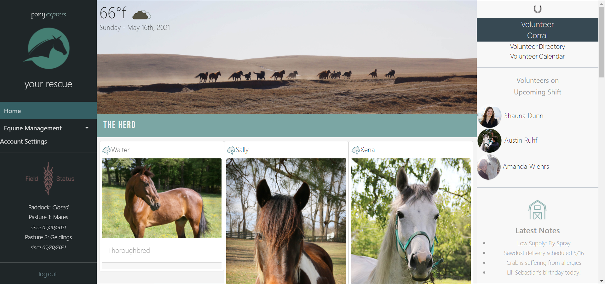

  
  

  
  # An Equine Rescue Management Application
  
  
  ---

  ## **Description**
    
 Pony Express was designed to assist in the operation of equine rescue organizations by providing an all-in-one platform to store records, schedule volunteers, manage equine appointments, and more - so that you can spend more time saving horses, and never worry about keeping track of all the information that comes with running a horse rescue. 

 
  
  ---
  
  ## Table of Contents  
  
  - [Description](#Description)  
  - [Usage](#Usage)
  - [Dependencies](#Dependencies)
  - [Contributions](#Contributions)
  - [License](#License)
 
  
  
  ---
  
  ## **Usage**
  
  Once Pony Express is loaded, the user is faced with a login screen. Here, the user may choose to log in with a unique sign in, or through Google. Once signed in, a polished dashboard loads with various navigational options; the user may see the weather, the current date, equine management, field management, volunteer management, and recent notes submitted by volunteers. The left sidebar offers equine management options under a drop-down menu, and the right sidebar offers volunteer management options. The center of the dashboard displays the horses currently active at the rescue. 
  
  Equine management gives the options of viewing an entire directory of every horse that has been at the rescue, the ability to view a calendar of upcoming appointment dates (a current work in progress,) and the option to add a new horse. To add a horse, the user can navigate to the "Add a Horse" button through the Directory.

  

  Volunteer management side contains a complete volunteer directory, with each volunteer's contact information and any relevant forms pertaining to the rescue. It should also include each volunteer's scheduling preferences for ease of scheduling; which can be found under the "Volunteer Calendar" page (a work in progress.) The user should also be able to add volunteers to the directory.

  
  ---

  ## **Dependencies**

  Pony Express is a MERN application using Mongoose, Express, React, and Node. In addition, it uses Cloudinary, Axios, Auth0, Bootstrap, Multer, Moment, and jQuery. 

  ---

  ## **Future Development**

  Future versions of Pony Express will contain a functional weather widget, volunteer scheduling, a developed volunteer directory, recurring calendar date alerts, a field management widget, a "Quick info" modal for individual horses, area to store PDFs and other documents, volunteer-side access to review any updates via a simple forum system, and the ability to submit notes to reflect on the dashboard for quick attention.

  ---

  ## **Deployment**

  Pony Express will ideally be deployed on Heroku at [this](https://pony-express-mgmt.herokuapp.com/) location. It will take additional development to troubleshoot Heroku deployment however as we are currently experiencing an unknown error.

  --- 

  ## **Contributions**
  
  This project was an equal collaboration between Austin Ruhf ([acruhf](https://www.github.com/acruhf)) , Shauna Dunn ([sleepytomatoes](https://www.github.com/sleepytomatoes)) , and Amanda Wiehrs ([awiehrs](https://www.github.com/awiehrs)).
  
  ---

  ## **License**

     
  
  This application is covered under the licensing rules from MIT
  